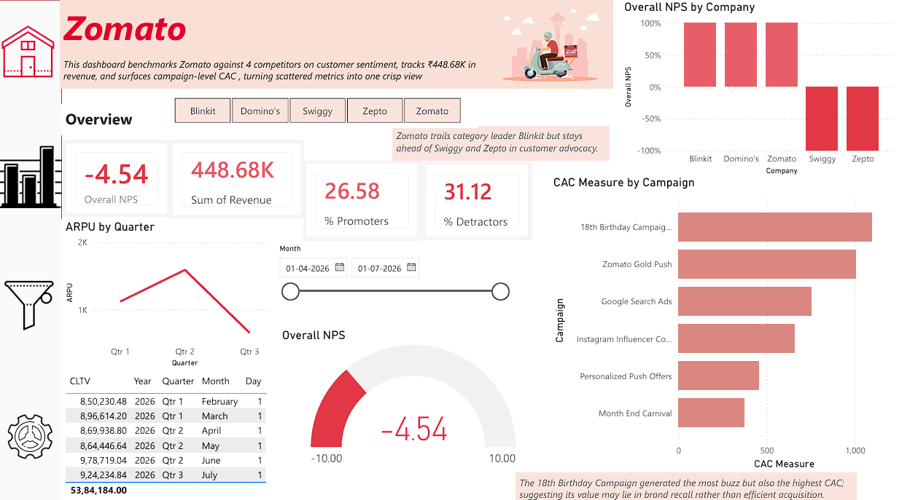

# Zomato-Performance-Dashboard-
Did Zomato's viral 18th birthday campaign actually pay off? A Power BI + DAX analysis of ARPU, CAC, and NPS benchmarked against Swiggy, Blinkit, Zepto &amp; Domino's.

# Zomato Performance Dashboard

A Power BI analytics project benchmarking Zomato against four competitors on customer sentiment, tracking revenue and lifetime value trends, and surfacing campaign-level marketing efficiency — including a focused case study on Zomato's real July 2026 18th-anniversary marketing campaign.

---

## 📌 Project Objective

This dashboard was built to answer three questions:

1. **How is Zomato performing on core growth metrics** : revenue per user (ARPU), customer lifetime value (CLTV), and customer acquisition cost (CAC)?
2. **How does Zomato's customer sentiment (NPS) compare to its direct competitors** — Swiggy, Blinkit, Zepto, and Domino's?
3. **Did Zomato's viral 18th birthday marketing campaign (July 10, 2026) actually convert to efficient customer acquisition, or was it primarily a brand-awareness play?**

---

## 🗂️ Data Sources & Disclosure

**This project uses synthetic data, not real Zomato financial or user data.**
This has been done to maintain the legacy of privacy and the unavailabilty of the real dataset.

Zomato's actual internal revenue, user-level, and campaign-spend figures are confidential and not publicly available. To make this project realistic and relevant rather than generic, the datasets were:

- **Structured** to match Zomato's real business model (order-based food delivery revenue, multi-channel marketing spend)
- **Modeled** around Zomato's real, publicly reported 18th birthday campaign (July 2026) — a logo-free red newspaper ad and an Instagram collaboration with Feeding India — which drew public debate over whether the campaign's buzz converted into measurable business results
- **Generated using Python** (pandas + numpy) with intentional patterns built in (e.g., a discount-driven dip in July's average revenue per user, and a higher CAC for the birthday campaign relative to always-on channels), so the dashboard would have a genuine, discoverable story rather than flat, random numbers

Aggregate, real figures referenced in the project narrative (e.g., Zomato parent company Eternal's overall revenue growth) are sourced from Eternal Ltd.'s public investor relations disclosures.

| File | Description |
|---|---|
| `Zomato_RevenueData.xlsx` | Synthetic monthly revenue per user, Feb–Jul 2026 |
| `Zomato_MarketingData.xlsx` | Synthetic campaign spend & new customers by channel, Feb–Jul 2026 |
| `NPS_Survey_Data.xlsx` | Synthetic respondent-level NPS survey (0–10 scale), Zomato + 4 competitors |

---

## 🛠️ Tech Stack

- **Power BI Desktop** — dashboard build, DAX measures, data modeling
- **Python (pandas, numpy)** — synthetic dataset generation
- **Excel** — source data format

---

## 📊 Key Metrics & DAX Logic

| Metric | Formula | What it answers |
|---|---|---|
| **ARPU** | `DIVIDE(SUM(Revenue), DISTINCTCOUNT(UserID))` | Revenue generated per active user |
| **CAC** | `DIVIDE(SUM(Expenses), SUM(NewCustomers))` | Cost to acquire one customer, per channel |
| **CLTV** | `SUM(Revenue) × 12` (annualized, per-customer) | Projected annual value of a customer |
| **NPS** | `%Promoters − %Detractors` (scores 9–10 = Promoter, 0–6 = Detractor) | Customer loyalty/advocacy, benchmarked vs. competitors |

*CLTV here uses a simplified annualized-revenue approach.*

---

## 🔍 Key Findings

- **Revenue dipped per user in July** despite a spike in active users : the birthday campaign's ₹180 discount drove volume but diluted average revenue per user (ARPU).
- **The 18th Birthday Campaign had the highest CAC (~₹1,094) of any marketing channel** — higher than Google Search Ads, Instagram, or the Month End Carnival — suggesting the campaign's viral reach did not translate into the most cost-efficient acquisition, consistent with the real-world debate around whether the campaign was a brand play rather than a performance one.
- **Zomato's NPS sits mid-pack among food delivery/quick-commerce peers**, trailing category leader Blinkit and running close to Domino's, while outperforming Swiggy and Zepto.
- **Overall blended NPS across all five companies is slightly negative (-4.54)**, reflecting a food-delivery category where detractors currently outweigh promoters industry-wide — a useful benchmark context for interpreting any single company's score.

---

## 👤 Author

Crafted by Sakshi Chamoli - because behind every viral campaign, there's a dataset waiting to be questioned
